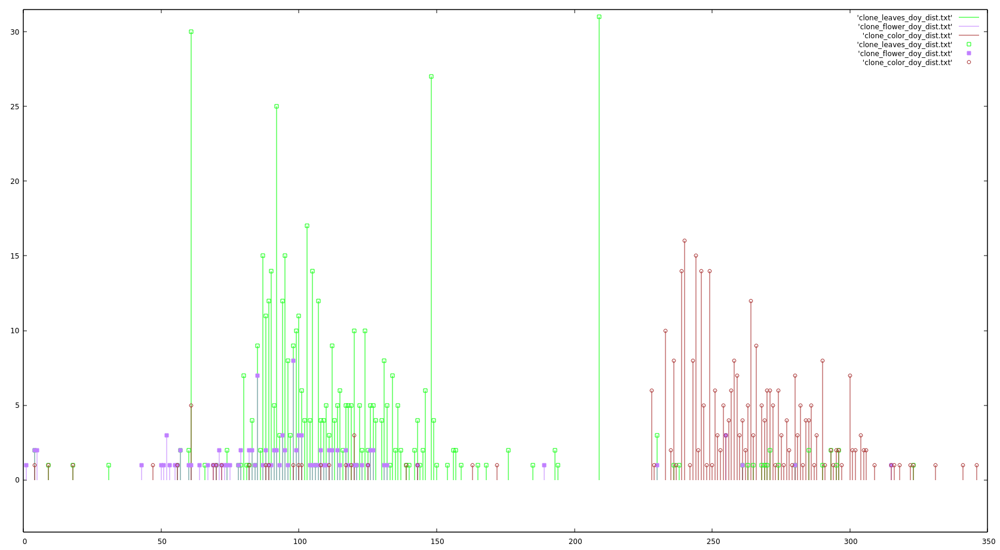

### DogWood days of spring  overview

There may not be a linnear path here so roughly chronogicaly with loops
are the  plain text  READMEs I tend to generate for myself in passing.

[Climate/README_backfill.txt](Climate/README_backfill.txt)  was the first thing
I looked into when Bryan posted the Dogwood data. Seemed having climate data
going back covering older phenophase reports could help train the ML.
It is not left in a horible state, the full season values should  usable if need be
but it does not stop and provide the partial accumulations on day of observation.

[README.postgis](README.postgis)  is about setting up postgres/postgis
to hold the various datasets (COUNT focused) & qgis to visualize it.
Starts with loading in the PRISM plant hardyness index as vector shapefiles
to provide a quasi-static climate summary.

[README_Soil.txt](README_Soil.txt)  First brutal exposure to raster Geotiff data.
Has a nunber of layers each the color of the soil at a given depth.
another constant per location for the machines to chew on.

[README.premise_test](README.premise_test)  It started bugging me that we
seemed bent on relying on difference without characterizing  what the same
meant.

[README.current_sample_selection](README.current_sample_selection) learned another team
was looking into this Dogwood sample choice as well.
Augmented their results with the Prism data I had ready.

[README.premise_redo](README.premise_redo) Return to charaterizing what the data we have
says about our basic premise but with slightly different assumptions
(first individual report instead of average of reports
 and a slightly different set of particular phenophases).
This doc is drifting off into data interpertation questions

There is a image generated there of the distribution of phenophase reports over "day of year"

There is a WorldClim in process
